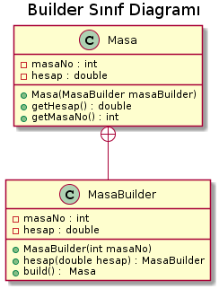

# Builder Pattern




## Masa Sınıfı
```java
package model;

public class Masa {
    private int masaNo;
    private double hesap;

    public Masa(MasaBuilder masaBuilder) {
        this.masaNo = masaBuilder.masaNo;
        this.hesap = masaBuilder.hesap;
    }

    public int getMasaNo() {
        return masaNo;
    }

    public double getHesap() {
        return hesap;
    }

    @Override
    public String toString() {
        return "Masa{" +
                "masaNo=" + masaNo +
                ", hesap=" + hesap +
                '}';
    }

    public static class MasaBuilder {
        private final int masaNo;
        private double hesap;

        public MasaBuilder(int masaNo) {
            this.masaNo = masaNo;
        }

        public MasaBuilder hesap(double hesap) {
            this.hesap = hesap;
            return this;
        }

        public Masa build() {
            return new Masa(this);
        }
    }
}

```


## Main
```java
  public static void main(String[] args) {
        Masa masa = new Masa
                .MasaBuilder(1)
                .hesap(27)
                .build();

        System.out.println(masa);
    }

```

## Sonuç
```java
Masa{masaNo=1, hesap=27.0}

```

