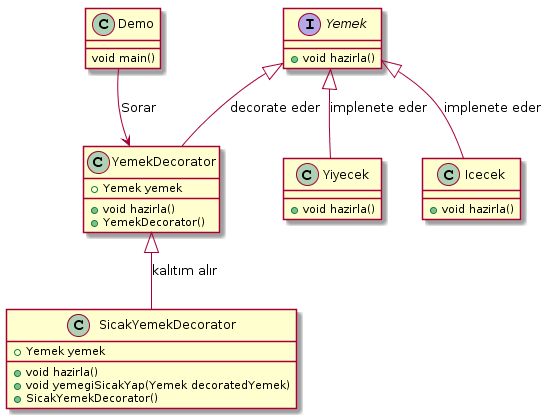

# Decorator Pattern



```java
public interface Yemek {
    void hazirla();
}

```


```java
public class Yiyecek implements Yemek {

    @Override
    public void hazirla() {
        System.out.println("Yemek : Yiyecek");
    }
}
```


```java
public class Icecek implements Yemek {

    @Override
    public void hazirla() {
        System.out.println("Yemek : Icecek");
    }
}

```

```java
public abstract class YemekDecorator implements Yemek {
    public Yemek decoratedYemek;

    public YemekDecorator(Yemek decoratedYemek) {
        this.decoratedYemek = decoratedYemek;
    }

    @Override
    public void hazirla() {
        decoratedYemek.hazirla();
    }
}

```


```java
public class SicakYemekDecorator extends YemekDecorator {

    public SicakYemekDecorator(Yemek decoratedYemek) {
        super(decoratedYemek);
    }

    @Override
    public void hazirla() {
        decoratedYemek.hazirla();
        yemegiSicakYap(decoratedYemek);
    }

    private void yemegiSicakYap(Yemek decoratedYemek) {
        System.out.println("Yiyecek durumu : sıcak");
    }
}
```


```java
public class DecoratorPatternDemo {
    public static void main(String[] args) {

        Yemek yiyecek = new Yiyecek();
        Yemek sicakYiyecek = new SicakYemekDecorator(new Yiyecek());
        Yemek sicakIcecek = new SicakYemekDecorator(new Icecek());

        System.out.println("Normal yiyecek hazırlama");
        yiyecek.hazirla();

        System.out.println("\nSıcak yiyecek hazırlanıyor");
        sicakYiyecek.hazirla();

        System.out.println("\nSıcak icecek hazırlanıyor");
        sicakIcecek.hazirla();
    }
}

```

## Çıktı:

```java

normal yiyecek hazırlama
Yemek : Yiyecek

Sıcak yiyecek hazırlanıyor
Yemek : Yiyecek
Yiyecek durumu : sıcak

Sıcak icecek hazırlanıyor
Yemek : Icecek
Yiyecek durumu : sıcak
```

## UML kodu

```java
@startuml
class Demo {
  void main()
}


interface Yemek {
   + void hazirla()
}

class Yiyecek {
   + void hazirla()
}

class Icecek {
   + void hazirla()
}

class YemekDecorator {
   + Yemek yemek

   + void hazirla()
   + YemekDecorator()
}

class SicakYemekDecorator {
   + Yemek yemek

   + void hazirla()
   + void yemegiSicakYap(Yemek decoratedYemek)
   + SicakYemekDecorator()
}


Yemek <|-- Yiyecek : implenete eder
Yemek <|-- Icecek : implenete eder
YemekDecorator <|-- SicakYemekDecorator : kalıtım alır
Yemek <|-- YemekDecorator : decorate eder

Demo --> YemekDecorator : Sorar
@enduml

```
